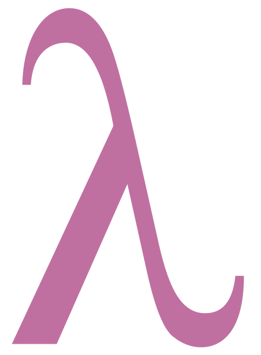

# Functional_Programming
Contains work on Functional programming in OCaml (and Java) for McGill COMP302 Winter 2020 coursework

### Fast-factorial using the Russian Peasant Algorithm 
```ml
(*Tail-recursive version*)
let fast_exp (base, power) = 
    let rec fast_exp_aux (base, power, acc) = 
    if base = 0 then 0 
    else 
        if power = 0 then acc  
        else 
        if  (odd power) then 
            fast_exp_aux (base*base,((power-1)/2),(acc * base)) 
        else 
        fast_exp_aux ((base*base), (power/2), acc)
    in 
    fast_exp_aux(base,power,1)
;; 
```



